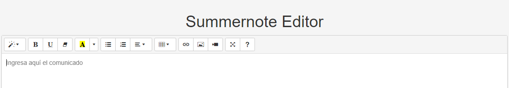

import EditorHTML_DEMO from '../../components/Wysiwyg-html-editor.astro';


Hay diferentes maneras de implementar un componente como lo es el editor html o "", por lo que nos dimos a la tarea de investigar, buscar y encontrar varias formas de hacer uso de este componente por medio de librerias como Jquery y boostrap o tambien usando React como framework.

Para entender cuando y como lo vamos a usar, nos dirigiremos a la documentacion de acuerdo a las necesidades de cada caso, entonces puedes seguir el siguiente "menu":

- [Usando Jquery, Bootstrap y summernote.](#usando-jquery-bootstrap-y-summernote)
  - [Paso a paso](#paso-a-paso)


## Usando Jquery, Bootstrap y summernote.

En este caso, vamos a usar el editor html para poder editar el contenido de un campo de texto, para ello vamos a usar la libreria [summernote](https://summernote.org/) que es una libreria de javascript que nos permite crear un editor de texto con muchas funcionalidades, como por ejemplo el uso de marcadores, listas, tablas, etc.

### Paso a paso

1. Incluimos las librerias dependientes (jQuery, bootstrap) en el archivo `index.html` de la aplicacion o en el componente que vamos a usar.
```html title="Editor-wysiwyg.html"
<!-- Incluimos librerias dependiente (jQuery, bootstrap) -->
<link href="https://stackpath.bootstrapcdn.com/bootstrap/3.4.1/css/bootstrap.min.css" rel="stylesheet">
<script src="https://code.jquery.com/jquery-3.5.1.min.js" is:inline></script>
<script src="https://stackpath.bootstrapcdn.com/bootstrap/3.4.1/js/bootstrap.min.js" is:inline></script>

<!-- include summernote css/js -->
<link href="https://cdn.jsdelivr.net/npm/summernote@0.9.0/dist/summernote.min.css" rel="stylesheet">
<script src="https://cdn.jsdelivr.net/npm/summernote@0.9.0/dist/summernote.min.js" is:inline></script>

<!-- Elemento por el cual vamos a invocar el editor. -->
<div id="summernote">Hello Summernote</div>

```


2. Destinaremos en este caso el uso del editor por medio de componentes, por lo que luego vamos a inovocarlo por medio de un codigo de Jquery.


```html
<script type="text/javascript">
	$(document).ready(function() {
    $('#summernote').summernote({
                    placeholder: 'Ingresa aquí el comunicado',
                    tabsize: 2,
                    height: 480, 
                    toolbar: [
                        ['style', ['style']],
                        ['font', ['bold', 'underline', 'clear']],
                        ['color', ['color']],
                        ['para', ['ul', 'ol', 'paragraph']],
                        ['table', ['table']],
                        ['insert', ['link', 'picture', 'video']],
                        ['view', ['fullscreen', 'help']]
                    ]
                    
                });
    });
</script>
```



<EditorHTML_DEMO />


Ahora, para el consumo correcto de este componente, debemos contectar el contenido, del lado del front al servidor y ser enviada a otro lado. Esto se logra de diversas manera y de acuerdo al entorno en donde estemos desarrollando/integrando esta funcion, mostrare un ejemplo enfocado a .NET en una estructura de ASPX.