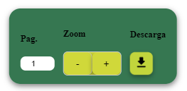

import Base from '../../components/0-Base.astro';
import NavBarFloater from '../../components/Floating-Navbar.astro';
import { Tabs, TabItem } from '@astrojs/starlight/components';

# Introducción
En la actualidad hacemos uso de menus, los cuales cumplen con ser el faciles de implementar, asi como tambien poder tener de una manera facil, disponen el menu de navegacion o accesos para ciertas Interfaces.   

<Base>
<NavBarFloater />

</Base>


## Ejemplo de la barra de navegacion flotante

Si bien tenemos la posiblidad de implementar un menu tipico de navegacion, podemos implementar un menu complementario para poder tener el menu disponible y que la barra de navegacion se mantenga y no sea necesario que se quede estatica.


<Tabs>
    <TabItem label="HTML" icon="star">
        ```html 
    <div class="floating-controls">
        <div class="InputContainer">
            <h4>Pag.</h4>
            <div>
                <input id="current_page_floating" class="current_page" value="1" type="number" />

            </div>
        </div>
        <div id="zoom_controls">
            <h4>Zoom</h4>
            <div class="zoom-button-group">
                <button id="zoom_out_floating" class="zoom_out">-</button>
                <button id="zoom_in_floating" class="zoom_in">+</button>
            </div>
        </div>
        <div class="download-print-controls">
            <h4>Descarga</h4>
            <button aria-label="Descargar manual" onclick="comprobadorDescarga()" >
                <svg width="15" height="18" viewBox="0 0 15 18" fill="none" xmlns="http://www.w3.org/2000/svg">
                    <path d="M12.4179 6.35294H10.7143V1.05882C10.7143 0.476471 10.2321 0 9.64286 0H5.35714C4.76786 0 4.28571 0.476471 4.28571 1.05882V6.35294H2.58214C1.62857 6.35294 1.14643 7.49647 1.82143 8.16353L6.73929 13.0235C7.15714 13.4365 7.83214 13.4365 8.25 13.0235L13.1679 8.16353C13.8429 7.49647 13.3714 6.35294 12.4179 6.35294ZM0 16.9412C0 17.5235 0.482143 18 1.07143 18H13.9286C14.5179 18 15 17.5235 15 16.9412C15 16.3588 14.5179 15.8824 13.9286 15.8824H1.07143C0.482143 15.8824 0 16.3588 0 16.9412Z" fill="black" />
                </svg>
            </button>
        </div>
    </div>
        ```
    </TabItem>
    <TabItem label="CSS" icon="moon">
        ```html collapse={4-80}
        <style>
/* Estilos para el menú flotante */
.floating-controls {
    position: fixed; /* Fijo en la pantalla */
    bottom: 20px; /* Separación desde el fondo */
    left: 50%; /* Centrar horizontalmente */
    transform: translateX(-50%); /* Asegura que esté completamente centrado */
    display: flex; /* Flexbox para alinear los elementos */
    gap: 15px; /* Espaciado entre los botones */
    background-color: rgba(4, 85, 37, 0.8); /* Fondo semi-transparente */
    padding: 15px 20px; /* Espacio interno (padding) */
    border-radius: 20px; /* Bordes redondeados */
    box-shadow: 0px 4px 10px rgba(0, 0, 0, 0.5); /* Sombra para darle efecto flotante */
    z-index: 70; /* Asegura que esté por encima del contenido, pero por debajo del modal */
    align-items: center; /* Alinear los elementos verticalmente */
    
    transition: opacity 0.3s ease, transform 0.3s ease; /* Transiciones de opacidad y posición */
}

.floating-controls.show {
    opacity: 1;
    transform: translateX(-50%) translateY(0); /* Totalmente visible y centrada */
}

.floating-controls.hide {
    opacity: 0;
    transform: translateX(-50%) translateY(20px); /* Desplazada hacia abajo y oculta */
}

/* Estilos para los botones dentro de la isla flotante */
.floating-controls button {
    background: none; /* Sin fondo (puedes personalizarlo si quieres) */
    gap: 1px;
    width: 40px;
    height: 40px;
    border: none; /* Sin borde */
    color: white; /* Color de texto blanco */
    font-size: 18px; /* Tamaño de fuente */
    cursor: pointer; /* Mostrar el cursor de pointer (mano) al pasar */
    border-radius: 9px; /* Bordes redondeados */
    
} 

.floating-controls input {
    background-color: white; /* Fondo blanco para el input */
    color: black; /* Texto negro */
    padding: 5px; /* Espacio interno */
    border-radius: 9px; /* Bordes redondeados */
    border: none; /* Sin borde */
    text-align: center; /* Centrar el número */
    width: 50px; /* Tamaño fijo del input */
}

.zoom-button-group {
    display: inline-flex;
    border-radius: 8px;
    overflow: hidden;
    border: 1px solid #ccc; /* Borde que envuelve ambos botones */
    background-color: #D0D83A;
}

    .zoom-button-group button {
        background-color: #D0D83A;
        color: black;
        padding: 10px 15px;
        border: none;
        font-size: 18px;
        cursor: pointer;
        display: inline-block;
        min-width: 50px;
        filter: drop-shadow(0px 4px 4px rgba(0, 0, 0, 0.35));
    }

        .zoom-button-group button:first-child {
            border-right: 1px solid #ccc; /* Línea divisoria entre los botones */
        }

        .zoom-button-group button:hover {
            background-color: #ddd; /* Color de fondo al pasar el mouse */
        }

        .zoom-button-group button:active {
            background-color: #bbb; /* Color de fondo al hacer clic */
        }

button[aria-label="Descargar manual"] {
    background-color: #D0D83A; /* Fondo transparente inicialmente */
    border: none; /* Sin borde */
    cursor: pointer; /* Mostrar el cursor como puntero */
    filter: drop-shadow(0px 4px 4px rgba(0, 0, 0, 0.35));
    transition: background-color 0.3s ease, transform 0.3s ease; /* Transición suave */
}

    button[aria-label="Descargar manual"]:hover {
        background-color: #18AC54; /* Fondo con un color suave en hover */
        transform: scale(1.1); /* Escala el botón ligeramente en hover */
    }

    button[aria-label="Descargar manual"] svg {
        transition: fill 0.3s ease; /* Transición suave para el color del SVG */
    }

    button[aria-label="Descargar manual"]:hover svg {
        fill: #ddd; /* Cambia el color del icono a verde en hover */
    }

        </style>           
        ```
    </TabItem>
    <TabItem label="Demo">
            <iframe   style="width: 800px; height: 400px; border: none;" src="https://codi.link/ICAgIDxkaXYgY2xhc3M9ImZsb2F0aW5nLWNvbnRyb2xzIj4NCiAgICAgICAgPGRpdiBjbGFzcz0iSW5wdXRDb250YWluZXIiPg0KICAgICAgICAgICAgPGg0PlBhZy48L2g0Pg0KICAgICAgICAgICAgPGRpdj4NCiAgICAgICAgICAgICAgICA8aW5wdXQgaWQ9ImN1cnJlbnRfcGFnZV9mbG9hdGluZyIgY2xhc3M9ImN1cnJlbnRfcGFnZSIgdmFsdWU9IjEiIHR5cGU9Im51bWJlciIgLz4NCg0KICAgICAgICAgICAgPC9kaXY+DQogICAgICAgIDwvZGl2Pg0KICAgICAgICA8ZGl2IGlkPSJ6b29tX2NvbnRyb2xzIj4NCiAgICAgICAgICAgIDxoND5ab29tPC9oND4NCiAgICAgICAgICAgIDxkaXYgY2xhc3M9Inpvb20tYnV0dG9uLWdyb3VwIj4NCiAgICAgICAgICAgICAgICA8YnV0dG9uIGlkPSJ6b29tX291dF9mbG9hdGluZyIgY2xhc3M9Inpvb21fb3V0Ij4tPC9idXR0b24+DQogICAgICAgICAgICAgICAgPGJ1dHRvbiBpZD0iem9vbV9pbl9mbG9hdGluZyIgY2xhc3M9Inpvb21faW4iPis8L2J1dHRvbj4NCiAgICAgICAgICAgIDwvZGl2Pg0KICAgICAgICA8L2Rpdj4NCiAgICAgICAgPGRpdiBjbGFzcz0iZG93bmxvYWQtcHJpbnQtY29udHJvbHMiPg0KICAgICAgICAgICAgPGg0PkRlc2NhcmdhPC9oND4NCiAgICAgICAgICAgIDxidXR0b24gYXJpYS1sYWJlbD0iRGVzY2FyZ2FyIG1hbnVhbCIgb25jbGljaz0iY29tcHJvYmFkb3JEZXNjYXJnYSgpIiA+DQogICAgICAgICAgICAgICAgPHN2ZyB3aWR0aD0iMTUiIGhlaWdodD0iMTgiIHZpZXdCb3g9IjAgMCAxNSAxOCIgZmlsbD0ibm9uZSIgeG1sbnM9Imh0dHA6Ly93d3cudzMub3JnLzIwMDAvc3ZnIj4NCiAgICAgICAgICAgICAgICAgICAgPHBhdGggZD0iTTEyLjQxNzkgNi4zNTI5NEgxMC43MTQzVjEuMDU4ODJDMTAuNzE0MyAwLjQ3NjQ3MSAxMC4yMzIxIDAgOS42NDI4NiAwSDUuMzU3MTRDNC43Njc4NiAwIDQuMjg1NzEgMC40NzY0NzEgNC4yODU3MSAxLjA1ODgyVjYuMzUyOTRIMi41ODIxNEMxLjYyODU3IDYuMzUyOTQgMS4xNDY0MyA3LjQ5NjQ3IDEuODIxNDMgOC4xNjM1M0w2LjczOTI5IDEzLjAyMzVDNy4xNTcxNCAxMy40MzY1IDcuODMyMTQgMTMuNDM2NSA4LjI1IDEzLjAyMzVMMTMuMTY3OSA4LjE2MzUzQzEzLjg0MjkgNy40OTY0NyAxMy4zNzE0IDYuMzUyOTQgMTIuNDE3OSA2LjM1Mjk0Wk0wIDE2Ljk0MTJDMCAxNy41MjM1IDAuNDgyMTQzIDE4IDEuMDcxNDMgMThIMTMuOTI4NkMxNC41MTc5IDE4IDE1IDE3LjUyMzUgMTUgMTYuOTQxMkMxNSAxNi4zNTg4IDE0LjUxNzkgMTUuODgyNCAxMy45Mjg2IDE1Ljg4MjRIMS4wNzE0M0MwLjQ4MjE0MyAxNS44ODI0IDAgMTYuMzU4OCAwIDE2Ljk0MTJaIiBmaWxsPSJibGFjayIgLz4NCiAgICAgICAgICAgICAgICA8L3N2Zz4NCiAgICAgICAgICAgIDwvYnV0dG9uPg0KICAgICAgICA8L2Rpdj4NCiAgICA8L2Rpdj4=%7CLyogRXN0aWxvcyBwYXJhIGVsIG1lbsO6IGZsb3RhbnRlICovDQouZmxvYXRpbmctY29udHJvbHMgew0KICAgIHBvc2l0aW9uOiBmaXhlZDsgLyogRmlqbyBlbiBsYSBwYW50YWxsYSAqLw0KICAgIGJvdHRvbTogMjBweDsgLyogU2VwYXJhY2nDs24gZGVzZGUgZWwgZm9uZG8gKi8NCiAgICBsZWZ0OiA1MCU7IC8qIENlbnRyYXIgaG9yaXpvbnRhbG1lbnRlICovDQogICAgdHJhbnNmb3JtOiB0cmFuc2xhdGVYKC01MCUpOyAvKiBBc2VndXJhIHF1ZSBlc3TDqSBjb21wbGV0YW1lbnRlIGNlbnRyYWRvICovDQogICAgZGlzcGxheTogZmxleDsgLyogRmxleGJveCBwYXJhIGFsaW5lYXIgbG9zIGVsZW1lbnRvcyAqLw0KICAgIGdhcDogMTVweDsgLyogRXNwYWNpYWRvIGVudHJlIGxvcyBib3RvbmVzICovDQogICAgYmFja2dyb3VuZC1jb2xvcjogcmdiYSg0LCA4NSwgMzcsIDAuOCk7IC8qIEZvbmRvIHNlbWktdHJhbnNwYXJlbnRlICovDQogICAgcGFkZGluZzogMTVweCAyMHB4OyAvKiBFc3BhY2lvIGludGVybm8gKHBhZGRpbmcpICovDQogICAgYm9yZGVyLXJhZGl1czogMjBweDsgLyogQm9yZGVzIHJlZG9uZGVhZG9zICovDQogICAgYm94LXNoYWRvdzogMHB4IDRweCAxMHB4IHJnYmEoMCwgMCwgMCwgMC41KTsgLyogU29tYnJhIHBhcmEgZGFybGUgZWZlY3RvIGZsb3RhbnRlICovDQogICAgei1pbmRleDogNzA7IC8qIEFzZWd1cmEgcXVlIGVzdMOpIHBvciBlbmNpbWEgZGVsIGNvbnRlbmlkbywgcGVybyBwb3IgZGViYWpvIGRlbCBtb2RhbCAqLw0KICAgIGFsaWduLWl0ZW1zOiBjZW50ZXI7IC8qIEFsaW5lYXIgbG9zIGVsZW1lbnRvcyB2ZXJ0aWNhbG1lbnRlICovDQogICAgDQogICAgdHJhbnNpdGlvbjogb3BhY2l0eSAwLjNzIGVhc2UsIHRyYW5zZm9ybSAwLjNzIGVhc2U7IC8qIFRyYW5zaWNpb25lcyBkZSBvcGFjaWRhZCB5IHBvc2ljacOzbiAqLw0KfQ0KDQouZmxvYXRpbmctY29udHJvbHMuc2hvdyB7DQogICAgb3BhY2l0eTogMTsNCiAgICB0cmFuc2Zvcm06IHRyYW5zbGF0ZVgoLTUwJSkgdHJhbnNsYXRlWSgwKTsgLyogVG90YWxtZW50ZSB2aXNpYmxlIHkgY2VudHJhZGEgKi8NCn0NCg0KLmZsb2F0aW5nLWNvbnRyb2xzLmhpZGUgew0KICAgIG9wYWNpdHk6IDA7DQogICAgdHJhbnNmb3JtOiB0cmFuc2xhdGVYKC01MCUpIHRyYW5zbGF0ZVkoMjBweCk7IC8qIERlc3BsYXphZGEgaGFjaWEgYWJham8geSBvY3VsdGEgKi8NCn0NCg0KLyogRXN0aWxvcyBwYXJhIGxvcyBib3RvbmVzIGRlbnRybyBkZSBsYSBpc2xhIGZsb3RhbnRlICovDQouZmxvYXRpbmctY29udHJvbHMgYnV0dG9uIHsNCiAgICBiYWNrZ3JvdW5kOiBub25lOyAvKiBTaW4gZm9uZG8gKHB1ZWRlcyBwZXJzb25hbGl6YXJsbyBzaSBxdWllcmVzKSAqLw0KICAgIGdhcDogMXB4Ow0KICAgIHdpZHRoOiA0MHB4Ow0KICAgIGhlaWdodDogNDBweDsNCiAgICBib3JkZXI6IG5vbmU7IC8qIFNpbiBib3JkZSAqLw0KICAgIGNvbG9yOiB3aGl0ZTsgLyogQ29sb3IgZGUgdGV4dG8gYmxhbmNvICovDQogICAgZm9udC1zaXplOiAxOHB4OyAvKiBUYW1hw7FvIGRlIGZ1ZW50ZSAqLw0KICAgIGN1cnNvcjogcG9pbnRlcjsgLyogTW9zdHJhciBlbCBjdXJzb3IgZGUgcG9pbnRlciAobWFubykgYWwgcGFzYXIgKi8NCiAgICBib3JkZXItcmFkaXVzOiA5cHg7IC8qIEJvcmRlcyByZWRvbmRlYWRvcyAqLw0KICAgIA0KfSANCg0KLmZsb2F0aW5nLWNvbnRyb2xzIGlucHV0IHsNCiAgICBiYWNrZ3JvdW5kLWNvbG9yOiB3aGl0ZTsgLyogRm9uZG8gYmxhbmNvIHBhcmEgZWwgaW5wdXQgKi8NCiAgICBjb2xvcjogYmxhY2s7IC8qIFRleHRvIG5lZ3JvICovDQogICAgcGFkZGluZzogNXB4OyAvKiBFc3BhY2lvIGludGVybm8gKi8NCiAgICBib3JkZXItcmFkaXVzOiA5cHg7IC8qIEJvcmRlcyByZWRvbmRlYWRvcyAqLw0KICAgIGJvcmRlcjogbm9uZTsgLyogU2luIGJvcmRlICovDQogICAgdGV4dC1hbGlnbjogY2VudGVyOyAvKiBDZW50cmFyIGVsIG7Dum1lcm8gKi8NCiAgICB3aWR0aDogNTBweDsgLyogVGFtYcOxbyBmaWpvIGRlbCBpbnB1dCAqLw0KfQ0KDQouem9vbS1idXR0b24tZ3JvdXAgew0KICAgIGRpc3BsYXk6IGlubGluZS1mbGV4Ow0KICAgIGJvcmRlci1yYWRpdXM6IDhweDsNCiAgICBvdmVyZmxvdzogaGlkZGVuOw0KICAgIGJvcmRlcjogMXB4IHNvbGlkICNjY2M7IC8qIEJvcmRlIHF1ZSBlbnZ1ZWx2ZSBhbWJvcyBib3RvbmVzICovDQogICAgYmFja2dyb3VuZC1jb2xvcjogI0QwRDgzQTsNCn0NCg0KICAgIC56b29tLWJ1dHRvbi1ncm91cCBidXR0b24gew0KICAgICAgICBiYWNrZ3JvdW5kLWNvbG9yOiAjRDBEODNBOw0KICAgICAgICBjb2xvcjogYmxhY2s7DQogICAgICAgIHBhZGRpbmc6IDEwcHggMTVweDsNCiAgICAgICAgYm9yZGVyOiBub25lOw0KICAgICAgICBmb250LXNpemU6IDE4cHg7DQogICAgICAgIGN1cnNvcjogcG9pbnRlcjsNCiAgICAgICAgZGlzcGxheTogaW5saW5lLWJsb2NrOw0KICAgICAgICBtaW4td2lkdGg6IDUwcHg7DQogICAgICAgIGZpbHRlcjogZHJvcC1zaGFkb3coMHB4IDRweCA0cHggcmdiYSgwLCAwLCAwLCAwLjM1KSk7DQogICAgfQ0KDQogICAgICAgIC56b29tLWJ1dHRvbi1ncm91cCBidXR0b246Zmlyc3QtY2hpbGQgew0KICAgICAgICAgICAgYm9yZGVyLXJpZ2h0OiAxcHggc29saWQgI2NjYzsgLyogTMOtbmVhIGRpdmlzb3JpYSBlbnRyZSBsb3MgYm90b25lcyAqLw0KICAgICAgICB9DQoNCiAgICAgICAgLnpvb20tYnV0dG9uLWdyb3VwIGJ1dHRvbjpob3ZlciB7DQogICAgICAgICAgICBiYWNrZ3JvdW5kLWNvbG9yOiAjZGRkOyAvKiBDb2xvciBkZSBmb25kbyBhbCBwYXNhciBlbCBtb3VzZSAqLw0KICAgICAgICB9DQoNCiAgICAgICAgLnpvb20tYnV0dG9uLWdyb3VwIGJ1dHRvbjphY3RpdmUgew0KICAgICAgICAgICAgYmFja2dyb3VuZC1jb2xvcjogI2JiYjsgLyogQ29sb3IgZGUgZm9uZG8gYWwgaGFjZXIgY2xpYyAqLw0KICAgICAgICB9DQoNCmJ1dHRvblthcmlhLWxhYmVsPSJEZXNjYXJnYXIgbWFudWFsIl0gew0KICAgIGJhY2tncm91bmQtY29sb3I6ICNEMEQ4M0E7IC8qIEZvbmRvIHRyYW5zcGFyZW50ZSBpbmljaWFsbWVudGUgKi8NCiAgICBib3JkZXI6IG5vbmU7IC8qIFNpbiBib3JkZSAqLw0KICAgIGN1cnNvcjogcG9pbnRlcjsgLyogTW9zdHJhciBlbCBjdXJzb3IgY29tbyBwdW50ZXJvICovDQogICAgZmlsdGVyOiBkcm9wLXNoYWRvdygwcHggNHB4IDRweCByZ2JhKDAsIDAsIDAsIDAuMzUpKTsNCiAgICB0cmFuc2l0aW9uOiBiYWNrZ3JvdW5kLWNvbG9yIDAuM3MgZWFzZSwgdHJhbnNmb3JtIDAuM3MgZWFzZTsgLyogVHJhbnNpY2nDs24gc3VhdmUgKi8NCn0NCg0KICAgIGJ1dHRvblthcmlhLWxhYmVsPSJEZXNjYXJnYXIgbWFudWFsIl06aG92ZXIgew0KICAgICAgICBiYWNrZ3JvdW5kLWNvbG9yOiAjMThBQzU0OyAvKiBGb25kbyBjb24gdW4gY29sb3Igc3VhdmUgZW4gaG92ZXIgKi8NCiAgICAgICAgdHJhbnNmb3JtOiBzY2FsZSgxLjEpOyAvKiBFc2NhbGEgZWwgYm90w7NuIGxpZ2VyYW1lbnRlIGVuIGhvdmVyICovDQogICAgfQ0KDQogICAgYnV0dG9uW2FyaWEtbGFiZWw9IkRlc2NhcmdhciBtYW51YWwiXSBzdmcgew0KICAgICAgICB0cmFuc2l0aW9uOiBmaWxsIDAuM3MgZWFzZTsgLyogVHJhbnNpY2nDs24gc3VhdmUgcGFyYSBlbCBjb2xvciBkZWwgU1ZHICovDQogICAgfQ0KDQogICAgYnV0dG9uW2FyaWEtbGFiZWw9IkRlc2NhcmdhciBtYW51YWwiXTpob3ZlciBzdmcgew0KICAgICAgICBmaWxsOiAjZGRkOyAvKiBDYW1iaWEgZWwgY29sb3IgZGVsIGljb25vIGEgdmVyZGUgZW4gaG92ZXIgKi8NCiAgICB9DQo=%7C" title="Editor de Texto"></iframe>
    </TabItem>
    <TabItem label="Imagen">
        
    </TabItem>
    <TabItem label="x">
        <NavBarFloater />
    </TabItem>
</Tabs> 


